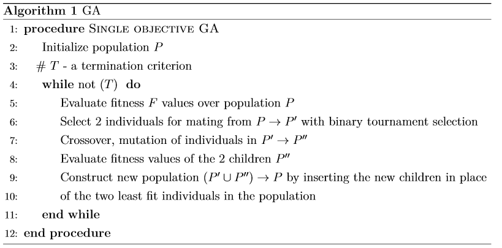

# GA_java
An implmentation of a sigle objective genetic algorithm in Java to solve the ```Knapsack problem```.
The goal is to find a combination of the given items, each one having ```size``` and ```value```, to maximize the total value of the items in the bag,
while not exceeding the size limit.
The bag is represented as a list of items with the specified value and size e.g.:
```[[value 1, size 10], [value 20, size 100], [value 5, size 15], ... ]```.
We encode a solution a list of boolean values. ```True``` value signifies that a particular item is included in the bag, while ```False``` that it is not.

As the ```fitness function``` we calculate the total value of the elements in the bag. If the total bag size exceeds the limit, we set its value to 0.
The pseudocode of the implmented algorithm is presented below:

 
